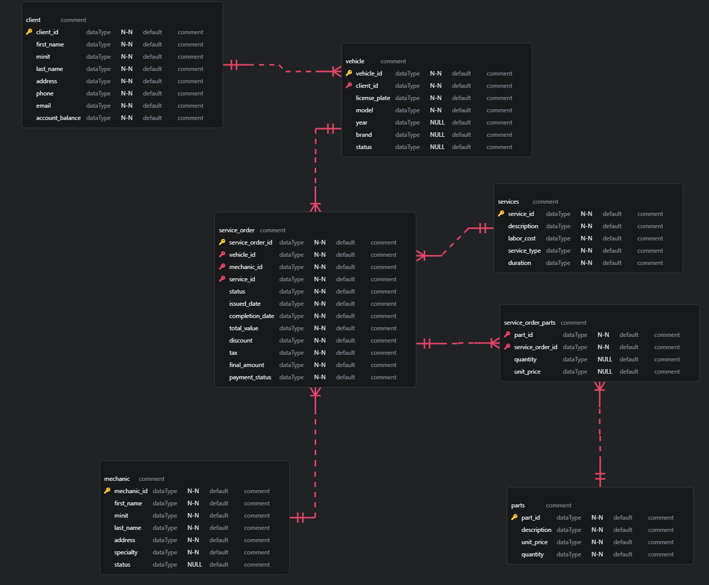

# Descrição do Desafio

Para este cenário você irá utilizar seu esquema conceitual, criado no desafio do módulo de modelagem de BD com modelo ER, para criar o esquema lógico para o contexto de uma oficina. Neste desafio, você definirá todas as etapas. Desde o esquema até a implementação do banco de dados. Sendo assim, neste projeto você será o protagonista. Tenha os mesmos cuidados, apontados no desafio anterior, ao modelar o esquema utilizando o modelo relacional.

Após a criação do esquema lógico, realize a criação do Script SQL para criação do esquema do banco de dados. Posteriormente, realize a persistência de dados para realização de testes. Especifique ainda queries mais complexas do que apresentadas durante a explicação do desafio. Sendo assim, crie queries SQL com as cláusulas abaixo:

- Recuperações simples com SELECT Statement;
- Filtros com WHERE Statement;
- Crie expressões para gerar atributos derivados;
- Defina ordenações dos dados com ORDER BY;
- Condições de filtros aos grupos – HAVING Statement;
- Crie junções entre tabelas para fornecer uma perspectiva mais complexa dos dados;

## Diretrizes

- Não há um mínimo de queries a serem realizadas;
- Os tópicos supracitados devem estar presentes nas queries;
- Elabore perguntas que podem ser respondidas pelas consultas
- As cláusulas podem estar presentes em mais de uma query

O projeto deverá ser adicionado a um repositório do Github para futura avaliação do desafio de projeto. Adicione ao Readme a descrição do projeto lógico para fornecer o contexto sobre seu esquema lógico apresentado.

# Solução encontrada

**client:**
Aqui ficam os dados dos clientes que trazem os veículos para a oficina.

- **client_id (PK)**: Identificador único do cliente.
- **first_name**: Primeiro completo do cliente.
- **minit**: inicial do meio (middle initial).
- **last_name**: Sobrenome do cliente.
- **address**: Endereço do cliente.
- **phone**: Número de telefone. Usado para entrar em contato, confirmar agendamentos ou informar sobre o status do veículo.
- **email**: E-mail do cliente.
- **account_balance**: Saldo devedor ou crédito. Se o cliente tem alguma dívida ou crédito em conta, isso aparece aqui.

**mechanic:**
A Mechanic contém as informações sobre os mecânicos que realizam os serviços na oficina.

- **mechanic_id (PK)**: Identificador único do mecânico.
- **first_name**: Primeiro completo do mecânico.
- **minit**: inicial do meio (middle initial).
- **last_name**: Sobrenome do mecânico.
- **address**: Endereço do mecânico.
- **specialty**: Especialidade. A especialização do mecânico, "Eletricista automotivo", "Mecânico de motores".
- **status**: Status do mecânico. Indica se o mecânico está ativo ou inativo no sistema.

**vehicle:**
Aqui ficam as informações dos carros que os clientes trazem para a oficina.

- **vehicle_id (PK)**: Identificador único do veículo.
- **client_id (FK)**: Relaciona o veículo ao cliente que o trouxe.
- **license_plate**: A placa do carro. Serve para identificar o veículo.
- **model**: Modelo do carro, o que ajuda a identificar os serviços que ele pode precisar.
- **year**: Ano de fabricação. Isso pode influenciar nas revisões ou manutenções do carro.
- **brand**: Marca do veículo. Isso ajuda a saber quais peças e serviços são mais indicados.
- **status**: Status do veículo. 'Em analise', 'Em conserto', 'Aguardando peças', 'Pronto para retirada', 'Concluido'.

**service_order:**
Aqui ficam todos os detalhes sobre o que será feito no veículo, incluindo serviços, peças e custos.

- **service_order_id (PK)**: Identificador único da ordem de serviço.
- **vehicle_id (FK)**: O carro que precisa do serviço.
- **mechanic_id (FK)**: O mecânico responsável pelo serviço.
- **service_id (FK)**: O tipo de serviço que será feito.
- **part_id (FK)**: As peças que serão usadas no serviço.
- **status**: O status da ordem de serviço, "Em andamento", "Finalizado", "Cancelado".
- **issued_date**: Quando a ordem de serviço foi criada.
- **completion_date**: Quando o serviço foi finalizado.
- **total_value**: O valor total da ordem, incluindo serviços e peças.
- **discount**: Qualquer desconto aplicado ao valor total.
- **tax**: Impostos aplicados.
- **final_amount**: O valor final, depois de descontos e impostos.
- **payment_status**: O status do pagamento, se foi pago, está pendente ou parcelado.

**service:**
Aqui ficam os tipos de serviços que a oficina oferece, como manutenção, reparos, etc.

- **service_id**: Identificador único do serviço.
- **description**: O que é o serviço, tipo "Troca de óleo", "Revisão completa".
- **labor_cost**: Custo de mão de obra. O valor que é cobrado pela execução do serviço.
- **service_type**: O tipo de serviço, "Manutenção", "Reparo", "Inspeção".
- **duration**: Quanto tempo o serviço vai levar, para organizar o agendamento.

**service_order_parts:**
Esta tabela associará ordens de serviço (service_order) com peças (part)

- **service_order_id (FK)**: Chave estrangeira que referencia a tabela service_order.
- **part_id (FK)**: Chave estrangeira que referencia a tabela parts.
- **unit_price**: O preço de cada unidade da peça.
- **quantity**: A quantidade da peça em estoque.

## Instruções

Para visualizar o arquivo:
`oficina.erd`

Precisa da Extensão:
https://marketplace.visualstudio.com/items?itemName=dineug.vuerd-vscode

## Execução do script Via Linha de Comando (psql):
`psql -U postgres -f create_oficina.sql -f insert_oficina.sql -f query_oficina.sql`

**[Explorando Comandos Básicos no PostgreSQL (Windows)](https://github.com/DavidRufino/Minha-Anotacoes-Heineken-Intelig-ncia-Artificial-Dados-Copilot/blob/main/2-3.%20Modelagem%20de%20Dados%20para%20Banco%20de%20Dados/README.md#explorando-comandos-b%C3%A1sicos-no-postgresql-windows)**